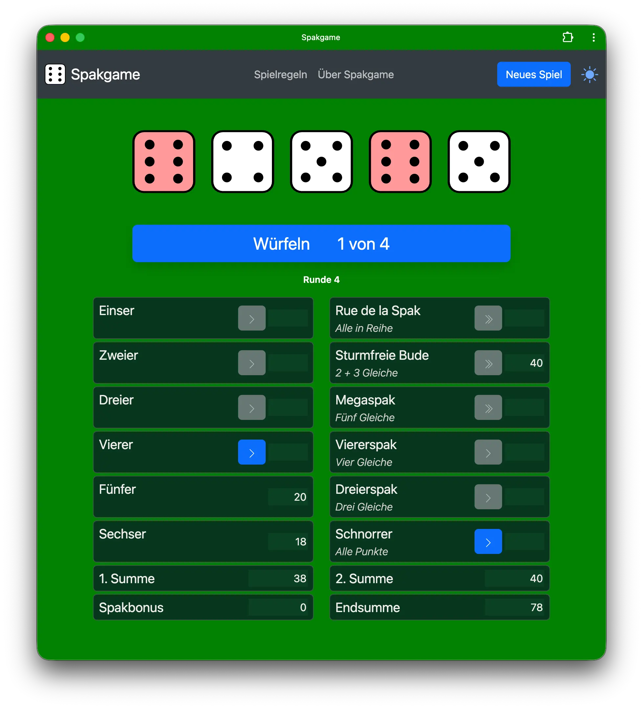

# Spakgame

## Spak, das Online-Würfelspiel.

@copyright: © 1999-2025 Niederrhein Studio <niederrhein.studio>  
@author: Sascha Schneider <sc@niederrhein.studio>  
@license: AGPL 3.0 only

## Screenshots

## Beschreibung

Spak ist ein einfaches Würfelspiel für einen Spieler. Ziel des Spiels ist es, 
durch geschicktes Würfeln und Setzen von Punkten eine möglichst hohe Punktzahl 
zu erreichen. Das Spiel ist inspiriert von klassischen Würfelspielen wie Kniffel
oder Yahtzee, bietet jedoch eine eigene Variante mit einzigartigen Regeln und 
Strategien, wodurch es nicht mehr auf eine festgelegte Anzahl von Runden, 
sondern über viele Runden hinweg gespielt wird und spannend bleibt.

## Transparenzhinweis

Das Spiel wurde ursprünglich 1999 entwickelt, zu einer Zeit, als das Bewusstsein
für ethisches Spieldesign und die Auswirkungen (von aus heutiger Sicht 
problemtischen „Dark Patterns“) noch nicht so ausgeprägt war wie heute. Dazu 
gehören unter anderem Belohnungssysteme und andere Mechanismen, die darauf 
abzielen, die Spieler zu längeren Spielsitzungen zu animieren. Diese 
Designentscheidungen sind zum Zeitpunkt der Entstehung bewusst getroffen worden, 
um die Spielerbindung zu erhöhen. Spieler sollten sich dieser Mechanismen 
bewusst sein und ihr Spielverhalten entsprechend reflektieren.

## Geschichte

Spakgame wurde ursprünglich 1999 für eine Online-Werbekampagne der Firma 
„Schneider & Coen IT-Dienstleistungen“ aus Krefeld als (zur damaligen Zeit 
technisch aktuellem) Java-Applet entwickelt. Einige Jahre später wurde das Spiel 
dann noch mal komplett neu in HTML, CSS und JavaScript implementiert.

## Technologie

Das Spiel ist komplett in HTML, CSS und JavaScript geschrieben und läuft direkt 
im Webbrowser. Es benötigt keinen Server oder Backend und speichert den 
Spielstand lokal im Browser.

## Features

- Einfache und intuitive Benutzeroberfläche
- Lokale Speicherung des Spielstands im Browser
- Kompatibel mit modernen Webbrowsern
- Responsive Design für verschiedene Bildschirmgrößen
- Open Source unter der AGPL 3.0 Lizenz

## Installation

### Installation mit Webserver:
1. Einen Webserver bereitstellen (z.B. Apache, Nginx, etc.) oder einen 
   Hosting-Dienst nutzen.
2. Den Quellcode als ZIP-Archiv downloaden und entpacken. Den Inhalt des 
   Archives dann in den Root-Ordner der Webseite kopieren.
3. Die Webseite im Browser aufrufen.
4. Viel Spaß beim Spielen!
5. Optional: Den Quellcode anpassen und erweitern, da das Spiel Open Source ist.

### Lokale Installation ohne Webserver:
1. Den Quellcode als ZIP-Archiv downloaden und entpacken.
2. Die Datei index.html im Browser öffnen.  
3. Viel Spaß beim Spielen!
4. Optional: Den Quellcode anpassen und erweitern, da das Spiel Open Source ist.

## Changelog

Das Changelog mit einer Übersicht über alle Änderungen und Versionen ist unter
[CHANGELOG.md](CHANGELOG.md) zu finden.
